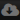
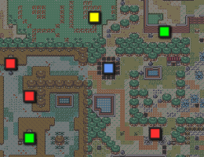
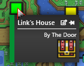
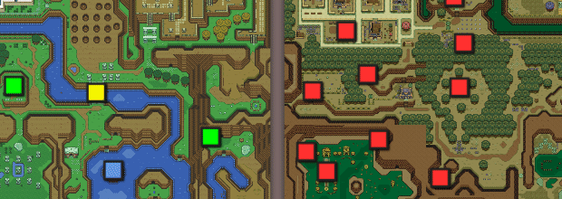
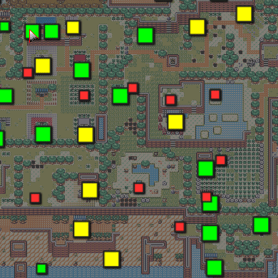

<blockquote class="quotable">
	Throughout this documetation, direct quotes from the program author will appear like this.
</blockquote>

Welcome to the **unofficial EmoTracker documentation**! I guess! [EmoTracker](https://emotracker.net/) is a program mainly focused on tracking *randomizer* playthroughs, helping organize and visualize items, locations, and other things. It relies on *packs* created by other people for most of its functionality.

Want to see (and search through) the Discord messages? Check the [online archive of EmoTracker's Discord](https://xkeeper.net/private/emotracker-discord/). Unofficial, of course. :)

----

<blockquote class="quotable" style="margin-top: 3em;">
	At this point, if I’m being honest, it is more likely that I remove the [documentation] tab from the website.
	  
	The Discord serves as the defacto source for documentation and help.
</blockquote>

You know what they say: if you want something done right...

## Contents

@TODO hey can you add a programmatic table of contents to github pages? :')

## Pages

This section is under construction.

* [Customizing](customizing)
* [Unsorted Information](unsorted) - unsorted notes and dumps from the discord

## Getting Started

When you first open the program, you will be told you have no installed packages. Good news: That's easy to fix!

### Installing Packages

Packages are installed by clicking the ** Package Manager** icon at the top right of the window. You can search for a given game or package name and install it.

### Manual Package Management

Installed packages are saved in your `Documents\EmoTracker\packs` folder.

To install a package manually, place its zip file in that folder.

For development, you can place a folder in this directory with the extracted contents of the pack, e.g. `Documents\EmoTracker\packs\cool-new-pack`.

### Choosing A Package

Clicking the ** Settings** icon in the top right of the window will allow you to choose a package to use. Some packs also support multiple trackers (e.g. normal, 'keysanity', 'entrance randomizer', etc).

## Tracking

Most trackers will supply a map with *locations* or *checks* to help keep track of what you have or have not seen yet.

Checks are typically color coded:

<table id="accessibility-key" style="width: unset;">
	<thead>
		<tr>
			<th colspan="2" class='c'>Color</th>
			<th class='c'>Meaning</th>
		</tr>
	</thead>
	<tbody>
		<tr>
			<td class='r'>
				

			</td>
			<td>Green</td>
			<td>Fully accessible.</td>
		</tr>
		<tr>
			<td class='r'>
				

			</td>
			<td>Yellow</td>
			<td><em>Potentially</em> accessible. Might require sequence breaks, glitches, or specific key routing.</td>
		</tr>
		<tr>
			<td class='r'>
				

			</td>
			<td>Blue</td>
			<td>Can be inspected; visible, but not accessible.</td>
		</tr>
		<tr>
			<td class='r'>
				

			</td>
			<td>Red</td>
			<td>Inaccessible.</td>
		</tr>
		<tr>
			<td class='r'>
				

			</td>
			<td>Orange</td>
			<td>Partially accessible; mixture of the above.</td>
		</tr>
		<tr>
			<td class='r'>
				

			</td>
			<td>Gray</td>
			<td>Cleared.</td>
		</tr>
	</tbody>
</table>

**I'm colorblind and/or these colors are hard to read. Help!**

You can change the colors used for locations. See [Customizing > Changing colors used for tracking](customizing#changing-colors-used-for-tracking).

### Tracking

By default, only accessible, un-cleared locations are visible; any locations marked as 

 Inaccessible or 

 Cleared will not appear on the map. This can be changed by toggling the *⚙️ &rarr; Tracking &rarr; Show All Locations* option (or by pushing F11).

To interact with the tracker:

* *Right* click a location to mark it as 

 Cleared.
* *Double click* a location to pin it.
*  *Left click **and hold*** on a location to open a small popup. (If you release the button while the cursor is in the popup area, it will stay open.)
	* *Left* clicking on a check will mark it as cleared (or increment its counter, depending).
	* *Right* clicking on a check will unmark it. *Note that this is the **opposite** behavior outside of this popup!*
	* Clicking the 📌 icon will pin or unpin the location.
	* Clicking the 📝 icon will open *another* popup that allows you to add notes.
		* Click the (+) button to add a new note.
		* Click the "✏️ Edit Markdown" to be able to enter text. *(This text is only visible if you click the 📝 button again.)*
		* There is an empty square at the right that can be used to add extra marks to a location. (These marks are visible in the tracker when hovering over the location, and can be removed by clicking the small trash icon that appears when hovering over them in this menu.)
		* Notes can be deleted by using the 🗑 Trash icon.

Example of adding and removing notes on a location:

Some trackers or locations may allow you to assign an additional icon to a location, which can be useful for locations that are visible but not accessible, or for tracking which location goes where.

You can also disable logic checks by choosing *⚙️ &rarr; Tracking &rarr; Ignore All Logic*, which is ~~how you end up with Discord documentation~~ useful if you need to change a mark that you accidentally set, or if the tracker's logic is incorrect. 

The *⚙️ &rarr; Layout* menu may have additional options for swapping the left and right sides of a tracker, showing or hiding the map, or more.

### Shortcuts and Hotkeys

* **Ctrl-S**: Saves the current tracker state.
* **Ctrl-Shift-S**: Same, but allows you to choose a filename.
* **Ctrl-O**: Opens a saved tracker state.
* **Ctrl-Z**: Undo
* **Ctrl-Mousewheel**: Zoom in/out.
* **Ctrl-0** (zero): Reset zoom level.
* **F1**: Opens the current pack's documentation URL.
* **F2**: Opens the *Broadcast View* window.
* **F5**: Reset tracker to its initial state, including any tracker-specific options.
* **F11**: Toggle showing *all* locations, including inaccessible or cleared ones.

