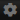

<style type="text/css">
	.quotable {
		padding-left: 50px;
		border-left: 5px solid #888;
		background-image: url('images/quote.png');
		background-repeat: no-repeat;
		background-position: 8px 4px;
		min-height: 40px;
		font-style: italic;
	}
	.accessibility-dot {
		width: 1em;
		height: 1em;
		border: 2px solid black;
		display: inline-block;
		vertical-align: middle;
	}

	.accessibility-normal { background-color: #0f0; }
	.accessibility-sequencebreak { background-color: #ff0; }
	.accessibility-inspect { background-color: #6495ed; }
	.accessibility-partial { background-color: #ff8c00; }
	.accessibility-none { background-color: #f00; }
	.accessibility-cleared { background-color: #333; }

	.status-generic-active { background-color: #888; }
	.status-generic-success { background-color: #888; }
	.status-generic-warning { background-color: #888; }
	.status-generic-error { background-color: #888; }


</style>

## Emotracker Documentation

Welcome to the **unofficial EmoTracker documentation**! I guess! [EmoTracker](https://emotracker.net/) is a program mainly focused on tracking *randomizer* playthroughs, helping organize and visualize items, locations, and other things. It relies on *packs* created by other people for most of its functionality.

<blockquote class="quotable">
At this point, if I’m being honest, it is more likely that I remove the [documentation] tab from the website.
<br><br>
The Discord serves as the defacto source for documentation and help.
</blockquote>

You know what they say: if you want something done right...


## Pages

<blockquote class="quotable">
	Throughout this documetation, direct quotes from the program author will appear like this.
</blockquote>


* [Common Problems](troubleshooting)


## Getting Started

When you first open the program, you will be told you have no installed packages. Good news: That's easy to fix!

### Installing Packages

Packages are installed by clicking the ** Package Manager** icon at the top right of the window. You can search for a given game or package name and install it.

### Manual Package Management

Installed packages are saved in your `Documents\EmoTracker\packs` folder.

To install a package manually, place its zip file in that folder.

For development, you can place a folder in this directory with the extracted contents of the pack, e.g. `Documents\EmoTracker\packs\cool-new-pack`.


### Choosing A Package

Clicking the ** Settings** icon in the top right of the window will allow you to choose a package to use. Some packs also support multiple trackers (e.g. normal, 'keysanity', 'entrance randomizer', etc).


## Tracking


Most trackers will supply a map with *locations* or *checks* to help keep track of what you have or have not seen yet.

Checks are typically color coded:


<table id="accessibility-key">
	<thead>
		<tr>
			<th colspan="2" style='text-align: center;'>Color</th>
			<th style='text-align: center;'>Meaning</th>
		</tr>
	</thead>
	<tbody>
		<tr>
			<td>
				<div class="accessibility-dot accessibility-normal"></div>
			</td>
			<td>Green</td>
			<td>Fully accessible.</td>
		</tr>
		<tr>
			<td>
				<div class="accessibility-dot accessibility-sequencebreak"></div>
			</td>
			<td>Yellow</td>
			<td><em>Potentially</em> accessible. Might require sequence breaks, glitches, or specific key routing.</td>
		</tr>
		<tr>
			<td>
				<div class="accessibility-dot accessibility-inspect"></div>
			</td>
			<td>Blue</td>
			<td>Can be inspected; visible, but not accessible.</td>
		</tr>
		<tr>
			<td>
				<div class="accessibility-dot accessibility-partial"></div>
			</td>
			<td>Orange</td>
			<td>Partially accessible; mixture of the above.</td>
		</tr>
		<tr>
			<td>
				<div class="accessibility-dot accessibility-none"></div>
			</td>
			<td>Red</td>
			<td>Inaccessible.</td>
		</tr>
		<tr>
			<td>
				<div class="accessibility-dot accessibility-cleared"></div>
			</td>
			<td>Gray</td>
			<td>Cleared.</td>
		</tr>
	</tbody>
</table>

**I'm color blind and/or these colors are hard to read. Help!**

Good news! The tracker supports replacing these specific colors. Simply create a new JSON file at `Documents\EmoTracker\application_colors.json`, with any of the following keys you want to change:

* Accessibility tracking:
	* <div class="accessibility-dot accessibility-normal"></div> <code>accessibility_normal</code>
	* <div class="accessibility-dot accessibility-sequencebreak"></div> <code>accessibility_sequencebreak</code>:
	* <div class="accessibility-dot accessibility-inspect"></div> <code>accessibility_inspect</code>
	* <div class="accessibility-dot accessibility-partial"></div> <code>accessibility_partial</code>
	* <div class="accessibility-dot accessibility-none"></div> <code>accessibility_none</code>
	* <div class="accessibility-dot accessibility-cleared"></div> <code>accessibility_cleared</code>
* I have no idea what these are used for
	* <div class="accessibility-dot status-generic-active"></div> <code>status_generic_active</code>
	* <div class="accessibility-dot status-generic-success"></div> <code>status_generic_success</code>
	* <div class="accessibility-dot status-generic-warning"></div> <code>status_generic_warning</code>
	* <div class="accessibility-dot status-generic-error"></div> <code>status_generic_error</code>

Example file:
```
{
  "accessibility_sequencebreak": "#ff00ff",
  "accessibility_cleared": "#000000"
}
```